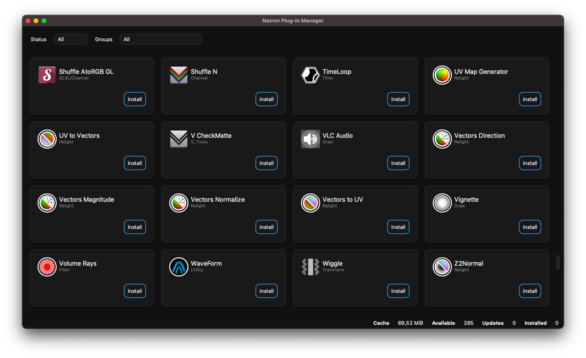
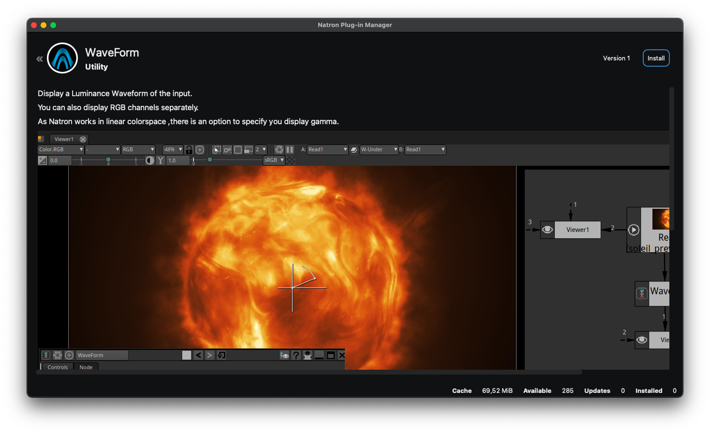

# Natron Plug-in Manager

A plug-in manager for [Natron](https://github.com/NatronGitHub/Natron).




## Build

This application requires Qt 5.14+ *(Concurrent/Network/Widgets)* and libzip.

```
git clone https://github.com/rodlie/NatronPluginManager
cd NatronPluginManager
mkdir build
cd build
cmake -DCMAKE_BUILD_TYPE=Release -DCMAKE_INSTALL_PREFIX=/usr ..
make
```

## Documentation

* [Natron Plug-in Repository Standard v1.0](docs/repo.md)

