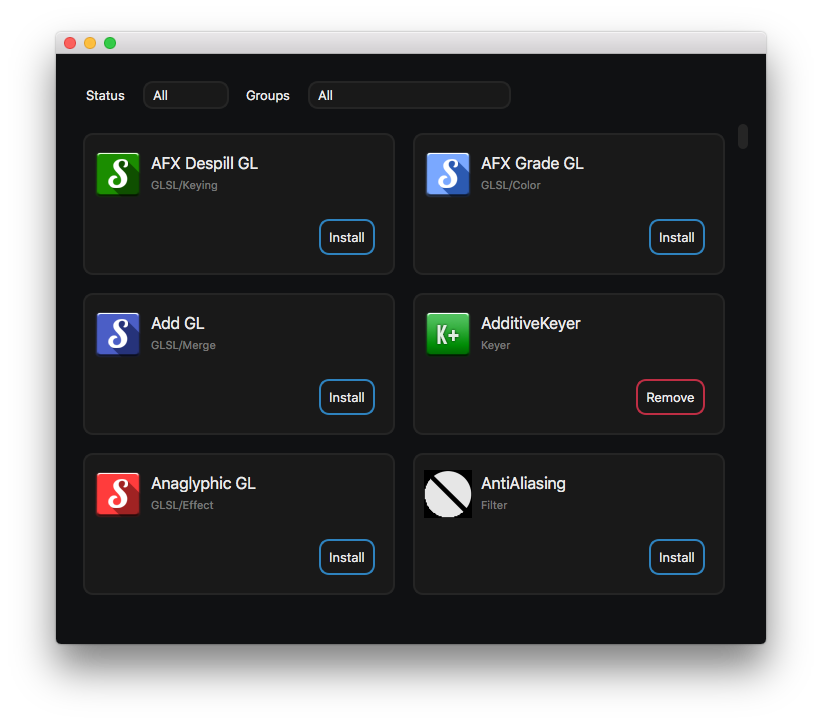

# Natron Plug-in Manager


A plug-in manager for [Natron](https://github.com/NatronGitHub/Natron).



<p align="center">
    <a href="https://github.com/rodlie/NatronPluginManager/releases/latest" target="_blank"></a>
</p>

## Build

This application requires CMake 3.5+, Qt 5.10+ (Concurrent/Network/Widgets) and libzip to build.

***Note**: Qt 5.14+ is required for markdown support, recommended.*

```
mkdir build && cd build
cmake -DCMAKE_BUILD_TYPE=Release -DCMAKE_INSTALL_PREFIX=/usr .. && make
```

## Documentation

* [Natron Plug-in Repository Standard v1.0](docs/repo.md)

## License

Copyright Ole-André Rodlie. All rights reserved.

This program is free software; you can redistribute it and/or modify it under the terms of the GNU General Public License as published by the Free Software Foundation; either version 2 of the License, or (at your option) any later version.

This program is distributed in the hope that it will be useful, but WITHOUT ANY WARRANTY; without even the implied warranty of MERCHANTABILITY or FITNESS FOR A PARTICULAR PURPOSE.  See the GNU General Public License for more details.

You should have received a copy of the GNU General Public License along with this program.  If not, see <http://www.gnu.org/licenses/>
